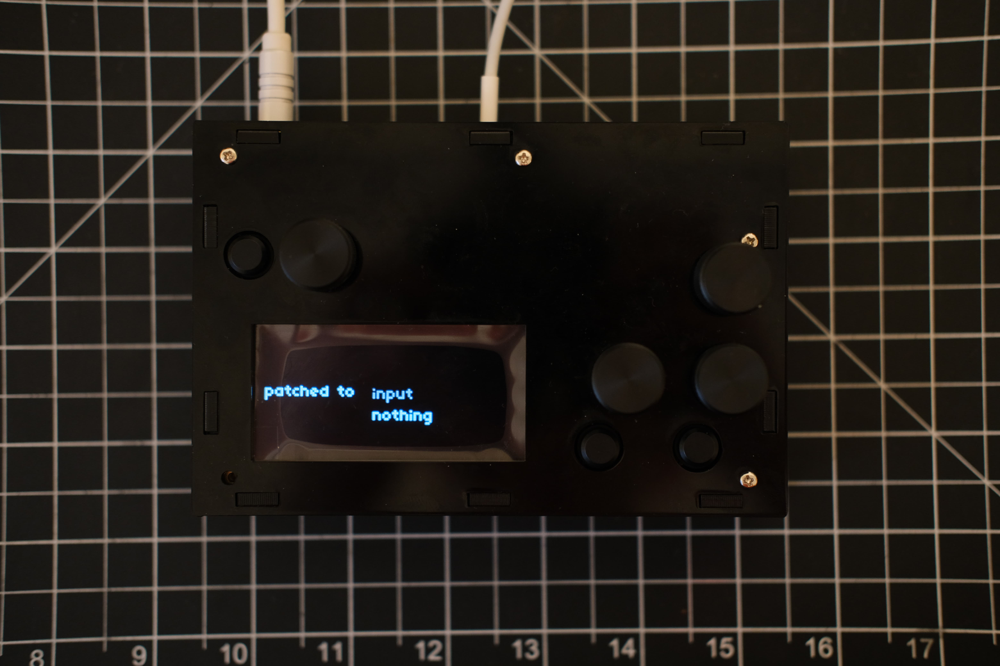

# sherry
Shairport norns script, incorporating metadata and potentially eq, vol options.

## Current features

* connect and disconnect shairport to norns input channel (crone_input)

This assumes that shairport loads on boot.

## Install

`;install https://github.com/Inkering/sherry`

## Feature outline (planned)

* set up jack connects between shairport and monome crone
* shairport-independent volume adjustment
* eq
* viewing metadata given by shairport

## references

* [shairport-sync-metadata-reader](https://github.com/mikebrady/shairport-sync-metadata-reader)

* [shairport-sync](https://github.com/mikebrady/shairport-sync-metadata-reader)
